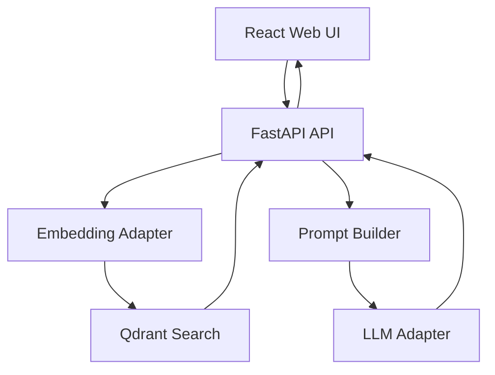

# Scriptura Lab

Open-source, local-first Bible study with RAG, local LLMs, and transparent sources.

Scriptura Lab is an experiment in building a biblical study assistant that is not just a chat box with opinions. The goal is to answer questions from indexed local sources, show what was used, and keep the retrieval layer visible enough to inspect.

## Why This Project Exists

Most AI Bible tools optimize for convenience first. Scriptura Lab is trying to optimize for:

- source-grounded answers instead of opaque responses;
- local-first execution instead of default cloud dependence;
- inspectable retrieval instead of hidden prompt stuffing;
- gradual, careful expansion of approved datasets instead of indiscriminate scraping.

## Current Status

`v0.2` is in progress. The first v0.2 change adds a configurable model provider
harness while keeping the v0.1 local RAG MVP working by default.

It currently includes:

- React + Vite + TypeScript web app
- FastAPI backend
- Qdrant vector database
- configurable model providers for generation and embeddings
- Ollama integration for local generation and embeddings
- optional OpenAI integration for external generation and embeddings
- Markdown source ingestion with frontmatter metadata
- answer + sources response flow
- basic automated tests for core backend behavior

It does not include yet:

- authentication
- Firebase
- public uploads
- hosted deployment
- mobile apps
- payments
- PostgreSQL
- copyrighted modern Bible translations

## What The MVP Does

1. A user opens the web UI.
2. The UI sends a biblical question to the API.
3. The API generates an embedding for the question using the configured embedding provider.
4. Qdrant retrieves the most relevant indexed chunks.
5. The backend builds a constrained prompt using only those sources.
6. The configured LLM provider generates an answer in Portuguese.
7. The UI renders the answer and the retrieved sources.

## Architecture



## Project Principles

- Local-first by default
- Retrieval before generation
- Explicit source metadata
- Clear boundaries around licensing and approved content
- Minimal infrastructure for the MVP

## Repository Layout

```txt
scriptura-lab/
  apps/
    api/                  FastAPI backend
    web/                  React frontend
  data/
    sample/
      sources/            Project-created sample study notes
  docs/                   Project docs and policies
  scripts/
    ingest/               Local ingestion entrypoint
  docker-compose.yml      Qdrant only
  .env.example            Local environment template
  Makefile                Convenience commands
```

## Local Stack

Frontend:

- React
- Vite
- TypeScript

Backend:

- Python
- FastAPI
- Pydantic
- `httpx`
- `qdrant-client`
- `python-frontmatter`

Infra:

- Qdrant via Docker Compose
- Ollama running locally outside Docker
- OpenAI API as an optional external provider

Default local models:

- `qwen2.5:7b`
- `bge-m3`

Fallback embedding model:

- `nomic-embed-text`

Optional OpenAI models:

- `gpt-5.5` for generation
- `text-embedding-3-small` for embeddings

## Quick Start

### 1. Copy environment variables

```bash
cp .env.example .env
```

### 2. Install Ollama models

```bash
ollama pull qwen2.5:7b
ollama pull bge-m3
```

Fallback embedding model:

```bash
ollama pull nomic-embed-text
```

To use OpenAI instead, set these values in `.env` and provide an API key:

```env
LLM_PROVIDER=openai
LLM_MODEL=gpt-5.5
EMBEDDING_PROVIDER=openai
EMBEDDING_MODEL=text-embedding-3-small
OPENAI_API_KEY=your-api-key-here
```

### 3. Start Qdrant

```bash
docker compose up -d
```

### 4. Install project dependencies

```bash
make install
```

### 5. Run the API

```bash
make api
```

### 6. Ingest sample sources

From the repository root:

```bash
make ingest
```

Expected output:

```txt
Loaded documents: 5
Created chunks: 5
Indexed chunks: 5
Collection: scriptura_sources
```

### 7. Run the web app

```bash
make web
```

Open:

- Web UI: [http://localhost:5173](http://localhost:5173)
- API docs: [http://localhost:8000/docs](http://localhost:8000/docs)
- Qdrant: [http://localhost:6333](http://localhost:6333)

## Makefile Commands

The repository includes a root `Makefile` for common local tasks:

```bash
make help
make install
make qdrant-up
make qdrant-down
make api
make web
make ingest
make test
make build-web
```

## API Endpoints

| Endpoint | Method | Purpose |
| --- | --- | --- |
| `/health` | `GET` | basic API status |
| `/health/llm` | `GET` | configured generation provider availability check |
| `/health/embeddings` | `GET` | configured embedding provider availability check |
| `/sources` | `GET` | list indexed source summaries |
| `/chat` | `POST` | run RAG answer generation |

### Example request

```json
{
  "question": "Qual a relação entre João 1 e Gênesis 1?",
  "response_language": "pt-BR",
  "source_languages": ["pt-BR", "en"]
}
```

### Example response shape

```json
{
  "answer": "João 1 se relaciona com Gênesis 1 principalmente...",
  "sources": [
    {
      "id": "john-1-note::chunk-0",
      "source_id": "john-1-note",
      "title": "João 1 - Nota de estudo",
      "type": "study_note",
      "language": "pt-BR",
      "reference": "John 1",
      "excerpt": "João 1 apresenta o Logos como preexistente...",
      "score": 0.87
    }
  ]
}
```

## Sample Data

`v0.1` ships only with project-created sample notes inside `data/sample/sources`.

These notes are intentionally small and safe:

- study notes
- lexical note
- explicit frontmatter metadata
- approved for indexing in the MVP

No modern copyrighted Bible translation is bundled or indexed.

## Data and Licensing Policy

Scriptura Lab should only index sources that are explicitly approved for:

- storage
- indexing
- retrieval
- excerpt display
- LLM context usage
- redistribution when applicable

Read the project policy here:

- [docs/data-policy.md](docs/data-policy.md)

## Testing

Run backend tests:

```bash
make test
```

Current automated coverage includes:

- API health behavior
- controlled LLM unavailable response
- configurable model provider factory
- OpenAI response parsing
- Markdown loader parsing and validation
- prompt builder rendering
- Qdrant adapter behavior for upsert and query mapping

## Documentation

- [docs/architecture.md](docs/architecture.md)
- [docs/local-setup.md](docs/local-setup.md)
- [docs/model-providers.md](docs/model-providers.md)
- [docs/rag-pipeline.md](docs/rag-pipeline.md)
- [docs/data-policy.md](docs/data-policy.md)

## Roadmap

Near-term directions after the v0.2 provider harness:

- better retrieval ranking and filtering
- richer source cards and retrieval inspection in the UI
- more robust chunking and ingestion diagnostics
- downloadable public-domain and permissively licensed source packages
- explicit source approval workflows
- support for additional original-language study datasets
- stronger evaluation and regression testing for grounded answers

## Contributing

The project is early, but contributions are welcome if they preserve the core direction:

- keep the stack simple;
- keep the retrieval layer inspectable;
- do not add copyrighted modern Bible texts without explicit permission;
- prefer small, verifiable changes over broad abstraction.

## License

This project is licensed under the MIT License.

See [LICENSE](LICENSE).
